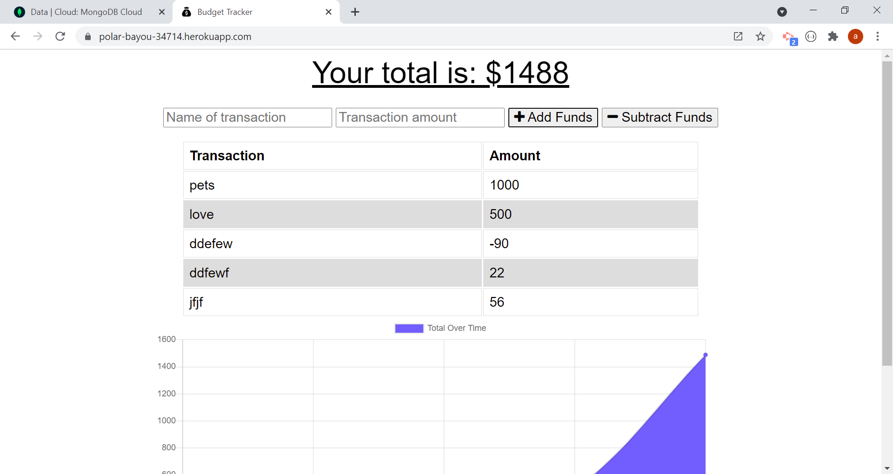

# Budget Tracker Starter Code

# Description
As an avid traveler, I wanted my website to have functionality ofline. Updating an existed budget tracker application, the user would  be able to add expenses and deposits to thier budget with or without connection. the offline functionality involved installing an IndexedDB, and  Service Worker. To provide users a mobile-first application, the application includes a web manifest. 
# installation
npm init

# Framework
node.js 
javascript 
JSON 
Express 
Mongoose 
IndexedDB 
Service Workers 
Web Manifest 
Heroku 

# Mock-Up

## website
https://polar-bayou-34714.herokuapp.com/
# Contributing 
aclarke0307  
# Github
https://github.com/aclarke0307/budget-tracker
